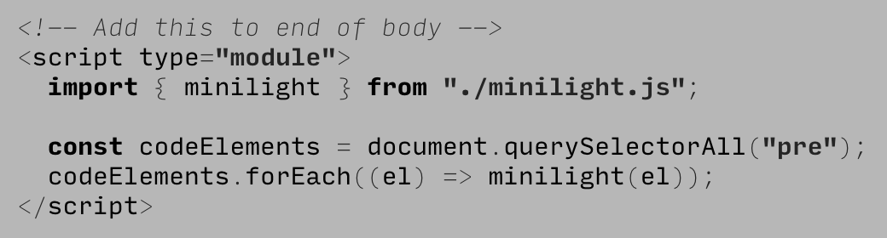
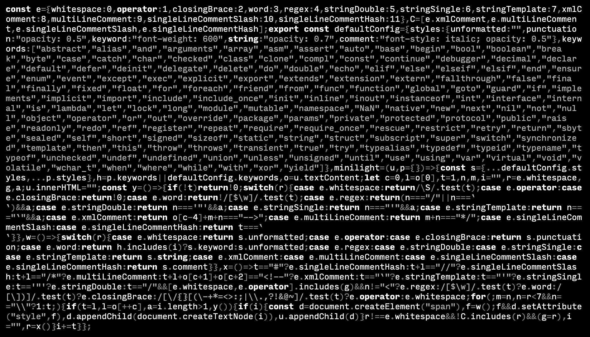

**minilight.js** is a small library (1.5k minified+gzipped) which improves
readability of code snippets by highlighting, for any programming
language, without attaching additional language packages or styles.

It is a fork of [microlight.js](https://github.com/asvd/microlight)
and took inspiration from [macrolight.js](https://github.com/xyzshantaram/macrolight).

You can load it and use it like this:

Here's minilight.js minified and highlighted by itself:

